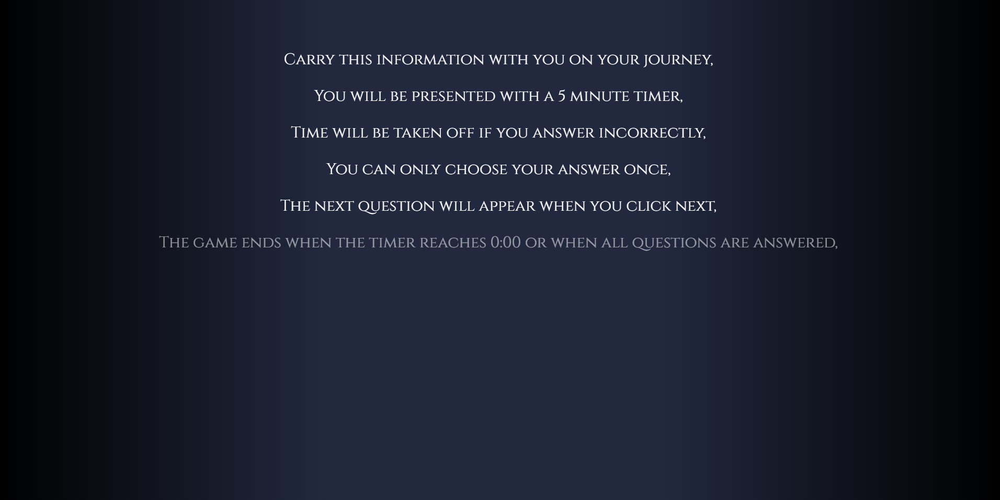
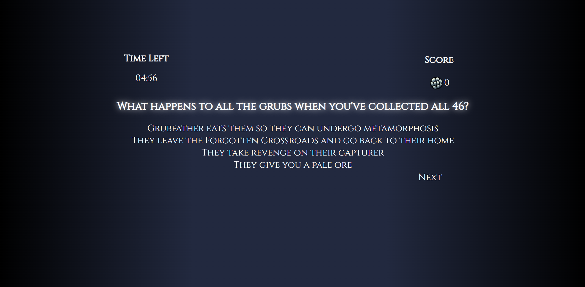
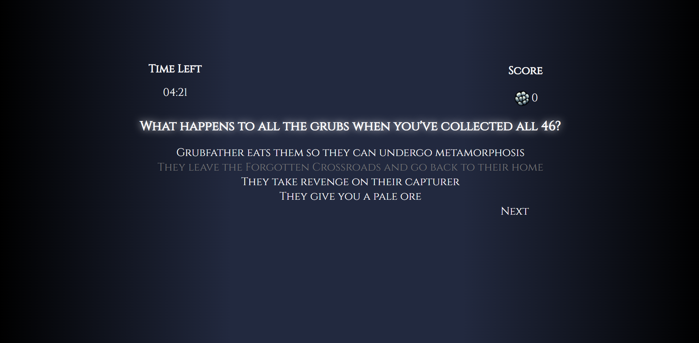
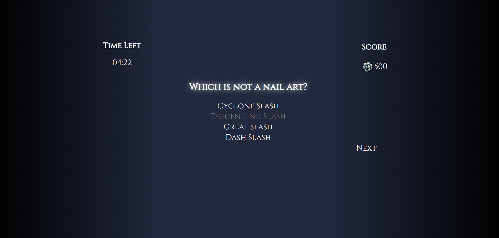

# Hollow Knight Quiz

## Description
This project utilizes document object model (DOM) manipulation through web APIs along with HTML, CSS, and JavaScript to create a 20 question, multiple-choice quiz game with a 5 minute timer based on the platform video game, Hollow Knight made by Team Cherry. Sharpen your nail and skills on this game's trivia!

## Usage
* Please click on the following link of the deployed website, https://leeclaire156.github.io/Hollow-Knight-Quiz/

* The following display should appear on screens upon load:
    

* Upon clicking Start Game, the instructions is fade in, line by line, referencing the game's initial scene. Clicking continue moves the player onto the quiz.
    
    

* The game has a 5 minute countdown with a -30 second penalty for each wrong answer. Players can only answer once and must click Next to continue their journey. Each correct answer is worth 125 geo.

    
    
    

* Players can save their scores with the initials at the end of the game on the following display:
    
    

* In addition, players can view their score in the Achievements page can bypass the instructions page by clicking Play Again or go back to the start page by clicking Quit Game

* Players can view the top 5 scores on the Achievements page:
    

* Again, pressing the Quit button brings the player back to the start page

## Credits and Tutorials followed:

### Hollow Knight Questions

* Special thanks to the [Hollow Knight Fanbase Wiki](https://hollowknight.fandom.com/wiki/Hollow_Knight_Wiki) for supplementing my writing for the questions and answers.

* Special thanks to [Team Cherry](https://www.teamcherry.com.au/) for developing and sharing Hollow Knight.

### HTML:

* Display layout credit goes to [Code Now](https://www.youtube.com/@docodenow):  
https://www.youtube.com/watch?v=3fbU4z7fPe4

### CSS:

* Relative position lesson supplied by [W3Schools](https://www.w3schools.com/):  
https://www.w3schools.com/css/css_positioning.asp

* Gradient generated by [Josh Comeau's](https://www.joshwcomeau.com/) gradient generator:  
https://www.joshwcomeau.com/gradient-generator/

* Text Shadow credit goes to [MDN Web Docs](https://developer.mozilla.org/en-US/):  
https://developer.mozilla.org/en-US/docs/Web/CSS/text-shadow#:~:text=The%20text%2Dshadow%20CSS%20property,%2C%20blur%20radius%2C%20and%20color.

* Instructions animation credit goes to [Dave](https://stackoverflow.com/users/1969888/dave):  
https://stackoverflow.com/questions/69474606/how-to-make-line-by-line-text-appearance

* Stretching h1 title credit goes to [DimistrisK](https://stackoverflow.com/users/7959459/dimitris-k):  
https://stackoverflow.com/questions/6351013/can-i-stretch-text-using-css

### JS:
* Arrow functions supplementary lesson supplied by [W3Schools](https://www.w3schools.com/):  
https://www.w3schools.com/js/js_arrow_function.

* addEventListener() method supplementary lesson supplied by [MDN Web Docs](https://developer.mozilla.org/en-US/):   
https://developer.mozilla.org/en-US/docs/Web/API/EventTarget/addEventListener#syntax

* forEach() method tutorial/supplementary lesson supplied by [W3Schools](https://www.w3schools.com/):  
https://www.w3schools.com/jsref/jsref_foreach.asp

* Inspiration credit for start page layout and save page layout goes to [Brian Design](https://www.youtube.com/@briandesign):   
https://www.youtube.com/watch?v=f4fB9Xg2JEY&t=110s

* Button placement and question array formatting credit goes to [CodingNepal](https://www.codingnepalweb.com/):   
https://www.codingnepalweb.com/quiz-app-with-timer-javascript/

* For moving between display pages credit goes to [Code Now](https://www.youtube.com/@docodenow):  
https://www.youtube.com/watch?v=3fbU4z7fPe4

* Building timer credit goes to [WEB CIFAR](https://www.youtube.com/@webcifar):   
https://www.youtube.com/watch?v=_a4XCarxwr8

* Template literals supplementary lesson supplied by[MDN Web Docs](https://developer.mozilla.org/en-US/):   
https://developer.mozilla.org/en-US/docs/Web/JavaScript/Reference/Template_literals#string_interpolation

* Template literals information also supplied by [try-catch-finally](https://stackoverflow.com/users/1078886/try-catch-finally) et al.:  
https://stackoverflow.com/questions/27678052/usage-of-the-backtick-character-in-javascript

* Maxlength characters for input text form credit goes to [MDN Web Docs](https://developer.mozilla.org/en-US/):  
https://developer.mozilla.org/en-US/docs/Web/HTML/Attributes/maxlength

* Input key event supplementary lessons supplied by [MDN Web Docs](https://developer.mozilla.org/en-US/):  
https://developer.mozilla.org/en-US/docs/Web/Events
https://developer.mozilla.org/en-US/docs/Web/HTML/Element/input/text

* Converting text to uppercase [i2tutorials](https://www.i2tutorials.com/):  
https://www.i2tutorials.com/convert-input-text-to-uppercase-using-javascript/#:~:text=JavaScript%20has%20two%20useful%20functions,toUpperCase()

* Score incrementing function credit goes to [James Q Quick's](https://www.youtube.com/@JamesQQuick) tutorial:  
https://youtu.be/BOQLbu_Crc0?list=PLDlWc9AfQBfZIkdVaOQXi1tizJeNJipEx&t=353

* JSON.parse/stringify supplementary lesson supplied by [W3Schools](https://www.w3schools.com/):  
https://www.w3schools.com/js/js_json_intro.asp

* JSON.parse/stringify supplementary lesson supplied also by [LogRocket](https://logrocket.com/):  
https://blog.logrocket.com/storing-retrieving-javascript-objects-localstorage/

* Score storage and display functions credit goes to [James Q Quick's](https://www.youtube.com/@JamesQQuick) tutorials:  
https://www.youtube.com/watch?v=DFhmNLKwwGw&list=PLDlWc9AfQBfZIkdVaOQXi1tizJeNJipEx&index=9
https://www.youtube.com/watch?v=jfOv18lCMmw&list=PLDlWc9AfQBfZIkdVaOQXi1tizJeNJipEx&index=10

* Local storage explanation supplied by [FolksTalk](https://www.folkstalk.com/):  
https://www.folkstalk.com/2022/09/how-push-objects-into-a-local-stotage-array-with-code-examples.html

* Special thanks for the nullish coalescing operator (??) operator supplementary lesson supplied by [Michael Karén](https://michael-karen.medium.com/):   
https://michael-karen.medium.com/how-to-save-high-scores-in-local-storage-7860baca9d68

* array.map() method supplementary lesson supplied by [MDN Web Docs](https://developer.mozilla.org/en-US/):  
https://developer.mozilla.org/en-US/docs/Web/JavaScript/Reference/Global_Objects/Array/map

### Music:
* Music on webpage tutorial supplied by [CodeSpeedy](https://www.codespeedy.com/):  
https://www.codespeedy.com/play-audio-after-page-load-in-javascript/

## Feature:
* The Hollow Knight main menu music will play and loop when the webpage is clicked on.